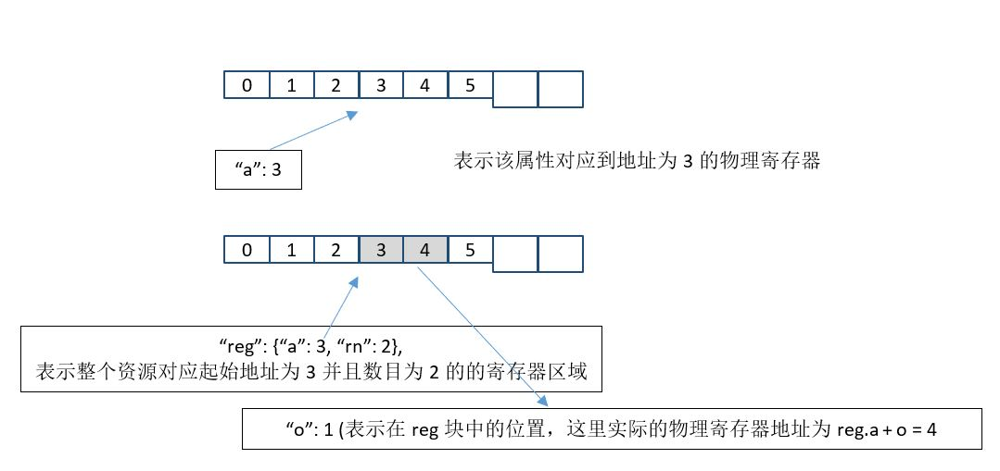

# MODBUS META文件格式说明

modbus_meta主要的目的是定义如何将一种设备的MODBUS寄存器映形式射到URI表示的资源属性形式，比如把寄存器地址1映射成资源”/t/ temperature”来访问。

 配置文件中一个资源属性映射的寄存器方式可以通过以下两种方式来指定：

1. 直接读取的地址: 使用字段”a”表示

2. 通过所在资源寄存器块的相对位置：使用”reg”+”o”两个字段组合完成



对于每一个属性定义只能选择其中一种方式。

## 格式定义

下面为modbus_meta.cfg的格式定义：

```
{
   "v":1,
   "dt":" control.T.yitai.yt-485 ",
   "ds":"This is a description",
   "ping":{
      "f":4,
      "r":1,
      "i":30
   },
   "links":[
      {
         "h":"/t",
         "rt":[
            "oic.r.temperature"
         ],
         "reg":{
            "fc":[
               4,
               6
            ],
            "a":1,
            "rn":1
         },
         "instances":10,
         "p":[
            {
               "n":"temperature",
               "fc":[
                  3
               ],
               "rn":1,
               "inst": 3,
               "multiplier":0.1,
               "a":4097
            }
         ]
      },
      {
         "h":"/on-off",
         "rt":[
            "modbus.yitai.yt485"
         ],
         "p":[
            {
               "n":"current",
               "vt":"f",
               "fc":[
                  3
               ],
               "rn":2,
               "o":4,
               "c":"abcd"
            }
         ]
      }
   ]
}
```


- “**v**”: format version

- “**dt**”: 此MODBUS设备类型名称

-  “**ping**”字段可选。用于检测设备是否在线的寄存器配置，“f”是功能码，“r”是MODBUS寄存器地址，“i”是的时间间隔（秒）。如果ping字段不存在，设备永远处于在线状态

- “links”

  - “**h**”为资源的URI. 
  - “**rt**”为资源的类型名称。如果不是以“modbus.”开头，系统中必须已经创建该rt的类型定义。
  - “**reg**”字段可选。表示整个资源可以通过一次性读取一整块寄存器来得到所有属性的数值。缺省方法是逐个属性读取寄存器。
    - fc: 支持的功能码，
    - a: 起始寄存器地址，
    - rn: 寄存器个数。
    - 注意：当 **instances**字段指示有多个资源实例时，这里a是第一个实例的起始地址，而rn表示单个资源实例占用的总寄存器个数（非所有实例总和）
  -  “**instances**”字段可不填，表示该类型资源的总个数，字段不存在表示1个。此字段要求上面的”reg”字段同时存在，其中“reg”的”a”表示instance 0的寄存器地址，”rn”表示每个instance的寄存器个数。

  - “**p**”字段描述该资源下所有的属性（数据点）

    - “**n**”: 属性名称。**注意：“n”的值不能随便自定义，必须是所在资源类型中（左边例子中则为oic.r.temperature）已经定义好的属性名称**。细节可参考后面说明。

    - "**fc**": 支持的功能码

    - "**rn**": 该属性使用的寄存器个数

    - "**multiplier**": 数值倍数, 可选项

    - "**a**": 寄存器地址

      说明：下面是另外一个资源"current"描述从整个寄存器块中定义属性的寄存器地址的方法

    - “**o**”: 该属性的寄存器在资源的整个寄存器块(reg)中的偏移量，有些设备只支持读整块寄存器，则只能使用此模式。“o”和”a”字段互斥，不能同时在一个属性中出现。

    - "**c**"：字节编码。当存在时，vt字段为”i”时当作4字节(双寄存器)整数处理，如果没有被解释成浮点类型。可选内容为：”abcd” | “dcba” | “badc” | “cdab”

    - "**vt**": 属性数值类型. 其中i: 整数， f: 浮点，自动使用2个寄存器.  b：布尔类型，s: 字符串。当rt类型以”modbus.”开头时必须提供，云端在自动生成对应的RT时需要此字段确定属性数据类型。其他情况下可不提供。

    - "**inst**": 属性的总个数，可选字段。如果有定义，每个属性实例为“{属性名}/{属性实例号}”，如"temp/1"。属性实例号从0开始增长

## **寄存器个数限制**：

·       对于coil类型功能码(1, 5)，每个属性寄存器个数是1。

·       对于register类型功能码(3, 6, 4, 7)，如果定义了浮点数值类型(vt=”f”)，寄存器个数必须为2。其他情况下，可以是1个或者2个寄存器。


**名称以“modbus.”****开头的资源类型的特殊功能**：

MODBUS META文件中如果一个资源的类型名称以”Modbus.”开头，第二个小节应该使用设备制造商的公司名称(全名如modbus.intel.humidity.H1001)。对于这种命名的资源类型，不需要在系统中预先存在对应资源类型的定义。当调用API上传modbus的META文件时，云端将自动直接从meta中提炼和生产对应的资源类型(rt)定义文件。

  

## 几个需要注意的地方

1. rt字段（RESOURCE TYPE）的选取尽量从OCF规范中选用合适的类型，如果实在找不到合适的类型后，才考虑使用自定义的类型。类型的名称请遵守规范： {组织或公司名称}.{资源类型名称}

2. dt字段的命名请遵守规范：

```
{sensor|control|switch}.{A-T-H-CO2}.{厂商}.{设备型号}
```

第二段中

- T: 温度, 

- H:湿度， 

- A：电流，

- CO2:二氧化碳, 

- EP: 电力传感器

 

如果其他传感类型,使用相同的方式定义缩写表示.

如果设备具有多种传感器能力，使用“-”来组合缩写